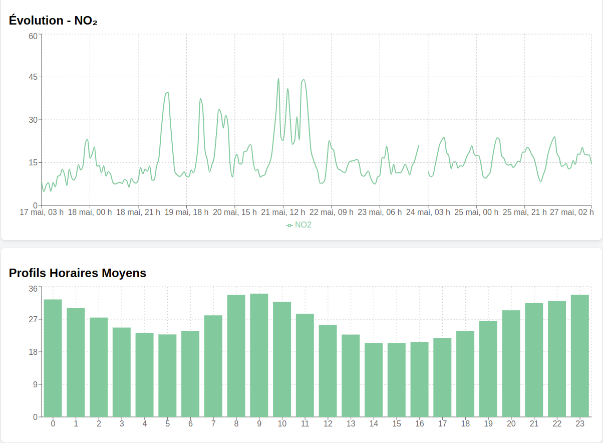

# 🌍 Air Quality Visualizer

**Air Quality Visualizer** est une application web construite avec **React** pour visualiser les données de **qualité de l’air** provenant de la plateforme [Data.gouv.fr](https://www.data.gouv.fr/fr/organizations/airparif-1/datasets/?page_size=20), publiées par **Airparif**.

Elle permet d’importer un fichier CSV contenant les mesures de pollution (NO₂, PM10, O₃, etc.), puis d’afficher ces données sous forme de **graphiques interactifs**.

---

## 📸 Aperçu

 

---

## 🚀 Démo

💻 En local : http://localhost:3000  

---

## 📦 Technologies utilisées

- **React** – Frontend JavaScript library
- **Recharts** – Librairie de graphiques
- **PapaParse** – Parsing des fichiers CSV
- **JavaScript**, **HTML**, **CSS**

---

## 📁 Structure du projet
---
air-quality-visualizer/
├── public/
├── src/
│ ├── components/
│ │ └── AirQualityChart.js
│ ├── App.js
│ ├── index.js
│ ├── index.css
│ └── data/
│ └── air_quality.csv
├── package.json
└── README.md


---

## ⚙️ Installation et démarrage

### 1. Cloner le dépôt

```bash
git clone https://github.com/votre-utilisateur/air-quality-visualizer.git
cd air-quality-visualizer
npm install
npm start
